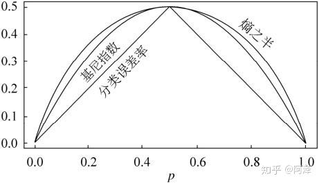

##  决策树

---

我们知道决策树是通过按照样本特征的值进行分类，将不同的样本进行划分，最终到达叶子节点出，得到样本的一个分类。所以最重要的一个问题就是，如何在所有的特征中找出那个特征作为筛选的条件就是一个重要的问题了。所以才ID3，C4.5 Cart树运用的就是不同大方式来选取当前最好的特征来进行
样本的划分。

对于决策树分流程：
 - 从根节点出发，逐渐递归至叶子节点的过程
 - 在递归过程中每次找到一个划分的属性，也就是如何找到最好的属性进行决策树的划分。

对于决策树的停止：
 - 当前的划分之后，所有的样本属于同一个类别时，不在进行划分。
 - 当前节点包含的样本集合为空，不能划分时。
 
### ID3

ID3算法采用的是奥卡姆剃刀原理 (用较少的东西，同样可以做好事情)：
越小的决策树越优于大型决策树。

1. 算法思想：对于ID3，采用的是通过一个叫信息增益的方式来度量特征，选择信息增量醉倒的特征进行分类。
我们知道信息熵越大，代表样本的纯度越低，也就是说样本的种类繁杂，因此分类的效果也就不会很好。
算法采用自顶向下的贪婪搜索遍(也就是每次找到信息增益最大的特征进行分类)历可能的决策树空间

2. 信息增益：
	ID3采用信息增益，表示了在选定特征的情况下样本集合不确定性的减少程度。
	
	熵的公式：$\sum -plogp$
	
	信息熵的公式：$H(D) = - \sum_{k=1}^K \frac{|C_k|}{|D|} log2 \frac{|C_k|}{|D|}$
	其中Ck表示的是集合D中属于第k类样本的子集。K代表的是D的类别数。
	
	对于某个具体的特征A，我们需要采用条件熵的概念：
	
	条件熵：指的是在通过特征A分类后对于集合D整体的信息熵的大小。具体就是对于特征A，有n个类别，对于每个类别，计算具体类别的信息熵。最后通过每个类别的
	概率进行整合所有的信息熵，得到最终的条件熵H(D|A)
	
	对于数据集D的条件熵H(D|A)为：
	$$H(D|A)=\sum_{i=1}^n \frac{|D_i|}{|D|}H(D_i)=- \sum_{i=1}^n \frac{|D_i|}{|D|}(\sum_{k=1}^K \frac{|D_{ik}|}{|D_i|} log2 \frac{|D_{ik}|}{|D_i|})$$
	其中Di指的是特征A的第i个值得子集，Dik指的是集合Di中的第k个类别值得子集。
	
	信息增益 = 信息熵 - 条件熵
	$$Gain(D,A) = H(D) - H(D|A) $$
	
	信息增益越大表示使用特征 A 来划分所获得的“纯度提升越大”。
	
3. 步骤：
	- 计算数据集的信息熵以及所有特征的条件熵，选取信息增益最大的特征作为当前的划分特征。
	- 删除上一步使用的特征，更新数据集合和特征集合。
	- 重复前两步当出现满足停止的情况(即子集中出现单一特征)，则划分为叶子节点。
	

4. 优缺点：
	- ID3 没有剪枝策略，容易过拟合；
    - 信息增益准则对可取值数目较多的特征有所偏好，类似“编号”的特征其信息增益接近于 1；
	- 只能用于处理离散分布的特征；
	- 没有考虑缺失值。

### C4.5

c4.5算法最大的特点就是克服了对特征数目偏重的缺点，不采用信息增益来选择特征，
而是用信息增益率来作为样本划分的标准。

1. 算法的思想：
	c4.5主要是针对ID3的问题进行了改进，主要是进行下面这几点：
	- 将离散值进行离散化，比如连续特征有m个值，C4.5将其排序去相邻节点去其均值，共m-1个划分点，分别计算一划分点做二元分类时的信息增益，并选择信息增益最大的点作为该特征的二元分类的离散点。
	- 对于缺失值的处理
		-  对于有缺失值得特征，计算未缺失部分的信息增益比，并乘以未缺失所占的比重。
		-  将缺失的样本按照未缺失样本中的不同类别所占比重的多少划分给未缺失的子样本中。
	
	- 采用了后剪枝策略

2. 	信息增益率：
	利用信息增益率来选取特征进行样本的划分
	$$Gain_{ratio}(D,A) = \frac{Gain(D,A)}{H_A(D)}$$
	$$H_A(D)=- \sum_{i=1}^n \frac{|D_i|}{|D|} log{2} \frac{|D_i|}{|D|}$$
	
	其中$H_A(D)$就是特征A的一个信息熵，在这里可以看出当A的熵越小 整体就会越大
	自然的就是说当属性有很多值时，虽然信息增益变大了，但是相应的属性熵也会变大。所以最终计算的信息增益率并不是很大。
	在一定程度上可以避免ID3倾向于选择取值较多的属性作为节点的问题。但是这也会有一个问题，
	就是如果选取属性只取一个值，属性熵就是0。我们知道一个数除以一个接近0的数，会变成无穷大。
	所以增益率可能会偏好取值比较少的属性。
	
	**因此C4.5采用了一个启发式的算法，先从候选属性中找出高于平均水平的属性，
	再从高于平均水平的属性中选择增益率最高的属性。**

3. 剪枝操作：
	我们知道非参数学习的模型特别容易过拟合，因此采用剪枝的方式降低决策树的复杂程度，解决过拟合。
	剪枝也分为两种  预剪枝和后剪枝
	
	- 预剪枝：是基于贪心的思想，在树还未建立之前定义些约束条件不让树进行生成。这样可以使得减少训练时间而且还可以降低过拟合的风险。但是也可能使得发生欠拟合的情况。
			 1. 预先定义好树的深度或最大叶节点个数或者每个叶节点中的样本数不能太少(不能小于一定值)。因此在节点分裂前会做一个判断是否是这些情况
				如果符合就不再进行节点分裂。
			 2. 节点划分前准确率比划分后准确率高。
			 3. 节点内数据样本低于某一阈值；

	- 后剪枝：后剪枝的方式就是在决策树生成之后，通过剪枝简化树的方式，通常后剪枝要比预剪枝要更好，但是所需的计算量以及时间会更多。
			
			1. reduced error pruning：该方式是需要一个测试集，然后通过bottom-up的方式，将子树替换成一个叶子节点，该叶子节点是子树所覆盖训练样本中存在最多的那个类来代替（回归树就用均值），
				然后对比替换前后在测试集上的表现决定是否替换，算法直至无子树可以替换为止。
			
			2. cost-complexity pruning：
			
			3. pessimistic pruning(悲观剪枝)：同样是采用自底向上的方式，对每个飞叶子节点采用一个最佳的叶子进行替换，如果剪枝后比剪枝前错误率没有增加，则进行替换。C4.5 通过训练数据集上的错误分类数量来估算未知样本上的错误率。
		
		
4. 缺点：
	虽然c4.5对ID3进行了改进但是也存在一些问题可以继续优化：
	1. 只能用于分类  
	2. 使用的信息增益率和连续值排序会很耗时
	3. C4.5采用的是多分叉树，用而分叉树更高效
	4. 在处理连续值是，因为要进行排序，从中选择分割点，但是如果数据量很大则会导致内存无法收纳以至于无法运行
	

### Cart (classification and regression Tree)

Cart算法是通过这样二分法的方式简化决策树的规模，是的效率比ID3 C4.5会有很大的提升。

CART决策树又称分类回归树，当数据集的因变量为连续性数值时，该树算法就是一个回归树，可以用叶节点观察的均值作为预测值；当数据集的因变量为离散型数值时，该树算法就是一个分类树，可以很好的解决分类问题。但需要注意的是，该算法是一个二叉树，即每一个非叶节点只能引伸出两个分支。

1. 思想：
	Cart树是一个二叉递归的过程，对其输入无论是连续值还是离散值，都会找一个二分类点就行分割。这个分类点事通过计算两类的Gini系数来确定的
	再通过测试集来评估Cart算法剪枝过程中的预测性能进行剪枝。剪枝采用的是代价复杂度剪枝。
	
2. Gini系数：
	由于之前的方式计算式会有大量的对数运算，基尼指数在简化模型的同时还保留了熵模型的优点。基尼指数代表了模型的不纯度，基尼系数越小，不纯度越低，特征越好。这和信息增益（率）正好相反。

	Gini系数公式：
	$$Gini(D) = \sum_{k=1}^K \frac{|C_k|}{|D|}(1-\frac{|C_k|}{|D|})
			  = 1 - \sum_{k=1}^K (\frac{|C_k|}{|D|})^2 Gini(D|A)
			  = \sum_{i=1}^n (\frac{|D_i|}{|D|})  Gini(D_i)
			$$
	
	根据基尼指数定义，可以得到样本集合D的基尼指数，其中Ck表示数据集D中属于第k类的样本子集。
	对于最后的求和  由于cart树是二分类树，因此求和部分只有两部分，即分为的D1和D2两类
	
	举个例子来解释一下这个公式吧
	
	体温特征是按照体温为恒温和非恒温进行划分。其中恒温时包括哺乳类5个、鸟类2个，非恒温时包括爬行类3个、鱼类3个、两栖类2个，如下所示我们计算D1,D2的基尼指数。
	
	
	
	然后计算得到特征体温下数据集的Gini指数，最后我们选择Gain_Gini最小的特征和相应的划分。
	
	
	
	通过上面的例子相信容易理解公式了，基尼系数越小代表数据的纯度越高，越稳定。通过上面的公式可以看出，基尼系数越小必然需要特征值有较多的分类，这和信息增益相似。
	
	基尼指数可以用来度量任何不均匀分布，是介于 0~1 之间的数，0 是完全相等，1 是完全不相等，
	
	**基尼系数采用了平方的计算替换了熵模型的取对数运算。但是其性能和熵模型有什么区别呢？**
	
		我们知道ln(x)的一阶泰勒展开是 -1+x+o(x)，所以
		$$H(X) = - \sum^K_{k=1} p_k ln p_k ≈ \sum^K_{k=1} p_k(1-p_k)$$
		
		由这个公式我们也就知道了，基尼系数其实是熵模型的一阶泰勒展开。
		
		
	
3. 	

cart树的实践复杂度是O(logm) 可以理解为每次一个特征被选择都会进行对半分的情况，类似于二分查找，所以时间复杂度为logm m为所有的样本数。
同时 cart树的高度也是 logm。

训练复杂度是 O(n * m * logm)  因为训练时会对每个维度 的每个样本找到最佳的划分点，n代表维度，m代表样本数， 

### Cart回归树

	其实Cart回归树和分类树的构建方式类似，这里就只说说其不同之处吧。
	
	1. 连续值的处理方法不同
		对于连续的特征，cart分类树采用基尼系数的大小来度量特征的划分点。在回归树中使用的是和方差的度量方式，对于任意划分特征 A，
		对应的任意划分点 s 两边划分成的数据集 D1和 D2，求出使 D1 和D2各自集合的均方差最小，同时 D1和 D2的均方差之和最小所对应的特征和特征值划分点。表达式为：
		
		其中， c1 为 D1 数据集的样本输出均值， c2为 D2 数据集的样本输出均值。
		
			
	2. 决策树建立后做预测的方式不同。
		对于预测的方式，上面讲到了CART分类树采用叶子节点里概率最大的类别作为当前节点的预测类别。而回归树输出不是类别，它采用的是用最终叶子的均值或者中位数来预测输出结果。

### 参考资料

[决策树之C4.5算法](https://zhuanlan.zhihu.com/p/89902999)

[决策树剪枝](https://zhuanlan.zhihu.com/p/73079137)

[机器学习之分类与回归树(CART)](https://zhuanlan.zhihu.com/p/36108972)

[Cart决策树](https://www.jianshu.com/p/ca55b0acf14d)