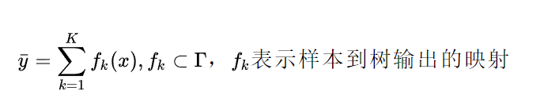

## 集成学习之决策树

---

在看完决策树部分之后，接下来在看到集成学习在决策树上的应用，主要学习Random Forest 、Adaboost 和GDBT这几个算法的基本原理，有时间在加上一些对sklearn中的方法进行使用。

### 集成学习

主要的集成学习框架有3种boosting 、 Bagging和Stacking。而Random Forest 、Adaboost 和GDBT就是通过这三种方式将树模型进行集成二得到的算法，所以在介绍树模型之前  先说一说这三种集成学习策略。

##### 1.Boosting

Boosting的思想主要是从错误中学习更正，得到更好的结果。

**思想：**

Boosting的思想就是：训练一对的若训练器，通过按照权重进行累加以后，得到一个能达到一定标准的强分类器。但是所分类器之间是按照时间顺序得到的，也就是说当前的弱分类器
是在前一个分类器和结果之前的误差基础上进行构建的，而且不同的弱化器都有一个不同的权重。当建立新的分类器不会显著提升准确率，就停止迭代。
最终在预测的时候才用加权的方式得到预测的结果。

##### 2.Bagging

Bagging的全称为Bootstrap(抽样) aggregating。其思想就是通过一堆弱学习器形成一个智囊团，每次通过智囊团投票的方式得到最后总预测结果。。

**思想：**

	首先，利用抽样的思想，对所有样本采样出一堆子训练集，在每个自训练集上学习一个若学习器，每次需要预测就通过这些学习器进行分别预测，
最后数目最多的类别为预测类别，对于回归的问题，最终使用所有学习器的结果的均值代表整个分类器的预测结果。所以Bagging和Boosting最大的区别就是  Bagging可以并行的训练分类器，但是Boosting只能按照顺序进行训练学习器

这里我们就会了解到，在说Cart树时，就提到过，这种单颗树的方式不稳定，如果数据集方式一点改变，那么模型将无法使用。但是如果采用Bagging的思想，那么
就没事，我们可以在训练一些新的弱化器，学习改变部分。因此当学习算法不稳定时，采用这种思想就比较好。

##### 3.Stacking
	
 Stacking 的思想就是利用全部的数据集进行训练模型，然后利用
 模型对每个训练样本进行预测，将预测值作为训练样本新的特征值，
 最终得到新的训练样本集，然后基于新的样本集训练得到模型，然后
 得到最终的预测结果。

**那么 我们再看看，用集成学习为什么要好一点呢？**
1. 首先，单个学习器可能并不能充分的学习数据里包含的规律，通过
	多个学习器的集成学习，可以有更好的一个泛化效果。
	
2. 假设能找到最好的学习器，但由于算法运算的限制无法找到最优解，只能找到次优解，采用集成学习可以弥补算法的不足；

### Random Forest
随机森林算法是用随机的方式建造多棵决策树，RF由多棵决策树组成，但是树之间没有什么联系。对于新的样本，每棵树都会给出一个预测结果
然后通过投票的方式来决定模型的最终输出(如果是回归型结果，就是将多棵树的结果取均值)。

**算法思想**：
随机森林算法采用的Bagging的算法思路，但是他在Bagging的思路是进行了改进。因此RF算法也是在Cart树作为弱学习器的基础构建的，其次这里的
cart树是做了改进的，由于RF算法在构建树的时候是选取部分特征（随机选择特征是指在每个节点在分裂过程中都是随机选择特征的（区别与每棵树随机选择一批特征）），在部分特征上选取最好特征进行划分样本的，所以这与cart有所不同。这样有助于进一步
提升其泛化能力。

我们假设其挑选的样本特征数目是$n_{sub}$，如果其值越小，对于RF来说会越健壮，但是在训练集上的的拟合效果会比较差，就是说$n_{sub}$越小，
模型的方差会减小，，在实际问题中，一般会通过交叉验证来得到合适的$n_{sub}$值。

**算法过程**：
对于样本集合$D=\{(x_,y_1),(x_2,y_2), ...(x_m,y_m)\}$,若学习器迭代T次，最终得到强学习器
对于每一次迭代
	-  随机选择样本，采用Bagging中的 bootstrap自助式采样方法，假设每轮采样m个样本
	-  对于每一轮样本，在随机采样$n_{sub}$ 个特征，在按照cart的算法进行构建
	-  最终构架T棵子树
模型的输出：如果是分类算法预测，则T个弱学习器投出最多票数的类别或者类别之一为最终类别。
如果是回归算法，T个弱学习器得到的回归结果进行算术平均得到的值为最终的模型输出。	

**优缺点**：
- 优点：
	1. 可以并行化训练模型，对于大数据集更高效
	2. 对于高纬度的数据，可以不用做特征筛选
	3. 由于采用了两次随机采样，训练出来的模型方差小，泛化能力强。
	4. RF的实现相比其他同类型算法实现简单，对于局部缺失特征不是很敏感。
* 缺点：
	1. 对于噪音大的数据集，容易过拟合
	2. 取值划分比较多的特征容易对RF的拟合效果产生严重影响  

**补充**：
基于RF，有很多变种算法，应用也很广泛，不光可以用于分类回归，还可以用于特征转换，异常点检测等。
	1.extra trees、2.Totally Random Trees Embedding(将数据从低维映射到高维，类似于SVM核函数)、3.Isolation Forest（以下简称IForest）是一种异常点检测的方法。它也使用了类似于RF的方法来检测异常点。 具体的原理可以在查资料
	
### AdaBoost

AdaBoost（Adaptive Boosting，自适应增强）,是集成学习Boosting方法的一个数的集成学习。
自适应体现在，前一个弱分类器的错误样本会在下一个训练器的训练样本中得到一个比较大的权重，似的下一个
学习器会更加重视这个错误样本，所有样本加权会给下一个训练器训练。每一次得到一个训练器，
直到达到某个预定的足够小的错误率或达到预先指定的最大迭代次数。

我们再来看看Boosting算法，首先从训练集用初始权重训练出一个弱学习器1，根据弱学习的学习误差率表现来更新训练样本的权重，
使得之前弱学习器1学习误差率高的训练样本点的权重变高，使得这些误差率高的点在后面的弱学习器2中得到更多的重视。
然后基于调整权重后的训练集来训练弱学习器2.，如此重复进行，直到弱学习器数达到事先指定的数目T，最终将这T个弱学习器通过集合策略进行整合，
得到最终的强学习器。

**算法思路**：

假设训练样本为：$T=\{(x_,y_1),(x_2,y_2), ...(x_m,y_m)\}$
训练集的在第k个弱学习器的输出权重为$D(k) = (w_{k1}, w_{k2}, ...w_{km}) ;\;\; w_{1i}=\frac{1}{m};\;\; i =1,2...m$

- 对于分类问题
	
	首先对于分类问题 我们计算第K个弱分类器$C_k(x)$在训练集上的加权误差率：
	$e_k = P(G_k(x_i) \neq y_i) = \sum\limits_{i=1}^{m}w_{ki}I(G_k(x_i) \neq y_i)$
	
	接着我们看弱学习器权重系数,对于二元分类问题，第k个弱分类器Gk(x)的权重系数为$\alpha_k = \frac{1}{2}log\frac{1-e_k}{e_k}$
	从上式可以看出，如果分类误差率ek越大，则对应的弱分类器权重系数αk越小。也就是说，误差率小的弱分类器权重系数越大。
	
	更新新样本权重D。假设第k个弱分类器的样本集权重系数为$D(k) = (w_{k1}, w_{k2}, ...w_{km})$,则对应的第k+1个弱分类器的样本集权重系数为
	$$w_{k+1,i} = \frac{w_{ki}}{Z_K}exp(-\alpha_ky_iG_k(x_i))$$,这里Zk是规范化因子 $$Z_k = \sum\limits_{i=1}^{m}w_{ki}exp(-\alpha_ky_iG_k(x_i))$$
	从wk+1,i计算公式可以看出，如果第i个样本分类错误，则yiGk(xi)<0(因为对于二分类 1和-1两个类别)，导致样本的权重在第k+1个弱分类器中增大，如果分类正确，则权重在第k+1个弱分类器中减少.
	这就满足了错误的分类样本会得到一个大的权重。
	
	集合策略,Adaboost分类采用的是加权表决法，最终的强分类器为：$$f(x) = sign(\sum\limits_{k=1}^{K}\alpha_kG_k(x))$$

- 对于回归问题(以AdaBoost R2为例)
	

### GDBT
GDBT树（Gradient Boosting Decision Tree）指的是一种迭代的决策树，就是由一堆树通过Boosting方式组合成的一种算法，其泛化能力较强。

**算法思想**：
GBDT的含义就是用Gradient Boosting的策略训练出来的DT模型。模型的结果是一组回归分类树组合(CART Tree Ensemble)： T1 ... Tk 。其中 Tj 学习的是之前 j-1 棵树预测结果的残差，
模型最后的输出，是一个样本在各个树中输出的结果的和：

### 番外 

1. Boosting和Bagging的区别
	>1）样本选择上：
	>
	>Bagging：训练集是在原始集中有放回选取的，从原始集中选出的各轮训练集之间是独立的。
	>
	>Boosting：每一轮的训练集不变，只是训练集中每个样例在分类器中的权重发生变化。而权值是根据上一轮的分类结果进行调整。
	>
	>2）样例权重：
	>
	>Bagging：使用均匀取样，每个样例的权重相等
	>
	>Boosting：根据错误率不断调整样例的权值，错误率越大则权重越大。
	>
	>3）预测函数：
	>
	>Bagging：所有预测函数的权重相等。
	>
	>Boosting：每个弱分类器都有相应的权重，对于分类误差小的分类器会有更大的权重。
	>
	>4）并行计算：
	>
	>Bagging：各个预测函数可以并行生成
	>
	>Boosting：各个预测函数只能顺序生成，因为后一个模型参数需要前一轮模型的结果。

### 参考资料

[机器学习中最最好用的提升方法：Boosting 与 AdaBoost](https://zhuanlan.zhihu.com/p/57689719)

[关于Boosting和Bagging的详解以及区别](https://zhuanlan.zhihu.com/p/57689719)

[Bagging 和 随机森林 刘建平Pinard](https://www.cnblogs.com/pinard/p/6156009.html)